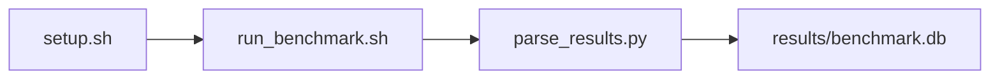

# GEMM / rocBLAS Microbenchmark Benchmark

[](LICENSE)
[](https://github.com/garys-gpu-benchmarks/317-gpu-bench-amd-gemm-rocblas-micro-ubu2604/actions/workflows/ci.yml)

Target: Ubuntu 26.04 · AMD · see Hardware Requirements. This is a host benchmark, not a laptop `pip install` project.

## Quick Start

```bash
git clone https://github.com/garys-gpu-benchmarks/317-gpu-bench-amd-gemm-rocblas-micro-ubu2604.git
cd 317-gpu-bench-amd-gemm-rocblas-micro-ubu2604
sudo bash setup.sh --assume-yes
bash run_benchmark.sh --profile smoke --validate
```
Results are written to `results/benchmark.db` and `results/summary.json`.

This workload is executed on the validation host after the repository is copied there. `setup.sh` and `run_benchmark.sh` do not open an outbound SSH session.

Prerequisites: Ubuntu 26.04; AMD; Python 3.14.4; root or sudo for `setup.sh`. Framework: Bash, SQLite, Python, PyYAML, ROCm Runtime, HIP/ROCm, rocBLAS, rocblas-bench. This is a host benchmark, not a laptop `pip install` project.



## 1. Overview

Runs the repository-local rocblas-bench for C = alpha*(A*B) + beta*C. dtype, M, N, K, transposeA, transposeB, alpha, beta, lda, ldb, ldc, and batch_count come from yaml. warmup_iters is passed as --cold_iters and norm_check as -v. -w and --norm_check are never passed. Sweep dimensions: dtype, M, N, K, transposeA, transposeB, alpha, beta.

## 2. What It Validates

- Validates rocBLAS GEMM throughput and, with norm_check=1, numerical correctness against the rocblas-bench CPU reference
- #1: Achieved compute throughput (achieved_compute_tflops); is present and physically sensible.
- #2: Kernel execution time (kernel_time_msec); is present and physically sensible.
- #3: Minimum operand traffic, GB/s (minimum_operand_traffic_gb_s); is present and physically sensible.
- #4: Relative L1 of checked columns (relative_l1_checked_columns); is present and physically sensible.
- #5: CPU reference GFLOPS (cpu_gflops) is present and physically sensible.

## 3. Metrics Captured

- **#1: Achieved compute throughput** — stored as `achieved_compute_tflops`.
- **#2: Kernel execution time** — stored as `kernel_time_msec`.
- **#3: Minimum operand traffic, GB/s** — stored as `minimum_operand_traffic_gb_s`.
- **#4: Relative L1 of checked columns** — stored as `relative_l1_checked_columns`.
- **#5: CPU reference GFLOPS** — stored as `cpu_gflops`.

## 4. Hardware Requirements

### Supported environment

- OS: Ubuntu 26.04
- GPU vendor: AMD
- Framework family: Bash, SQLite, Python, PyYAML, ROCm Runtime, HIP/ROCm, rocBLAS, rocblas-bench
- Python: Python 3.14.4

### Reference validation environment

The tables below describe the machine used to generate the reference results. They are not a requirement that every user buy that exact cloud instance.

### System

Ubuntu 26.04 / AMD / Bash, SQLite, Python, PyYAML, ROCm Runtime, HIP/ROCm, rocBLAS, rocblas-bench

### GPU

Ubuntu 26.04 / AMD / Bash, SQLite, Python, PyYAML, ROCm Runtime, HIP/ROCm, rocBLAS, rocblas-bench

## 5. Software Requirements

| Component | Version |
|---|---|
| OS | Ubuntu 26.04 |
| Kernel | kernel 7.0.0 |
| Python | Python 3.14.4 |
| ROCm | ROCm 7.14 |
| rocBLAS | rocBLAS 5.2.0 |

Runs the repository-local rocblas-bench for C = alpha*(A*B) + beta*C. dtype, M, N, K, transposeA, transposeB, alpha, beta, lda, ldb, ldc, and batch_count come from yaml. warmup_iters is passed as --cold_iters and norm_check as -v.

## 6. Installation

```bash
Run the repository-local rocblas-bench built from ROCm rocBLAS source by scripts/build.sh (rocm_compile_rocblas_bench)
```

## 7. Running the Benchmark

```bash
Run the repository-local rocblas-bench built from ROCm rocBLAS source by scripts/build.sh (rocm_compile_rocblas_bench)
```

**Validating results separately:**

```bash
export BENCHMARK_PYTHON=/usr/bin/python3.13  # optional
python3 -m venv .venv
source ".venv/bin/activate"
".venv/bin/python" scripts/validate_results.py
```

## 8. Output

### `results/benchmark.db` (SQLite)

rocblas-bench stdout in rocblas_bench.txt plus one CSV row written twice

sample_index,status,function,dtype,transposeA,transposeB,M,N,K,lda,ldb,ldc,batch_count,cold_iters,hot_iters,rocblas_gflops,rocblas_gemm_us,cpu_gflops,norm_error_1,achieved_compute_tflops,kernel_time_msec,minimum_operand_traffic_gb_s,relative_l1_checked_columns,error_message
0,ok,gemm,f32_r,N,N,4096,4096,4096,4096,4096,4096,1,5,20,12000,80,8000,1e-6,12,0.08,1500,1e-6,

```bash
Run the repository-local rocblas-bench built from ROCm rocBLAS source by scripts/build.sh (rocm_compile_rocblas_bench)
```

### `results/summary.json`

Consolidated metrics from the most recent run — suitable for CI artifact upload or dashboard ingestion.

### `results/raw/<timestamp>.txt`

rocblas-bench stdout in rocblas_bench.txt plus one CSV row written twice

sample_index,status,function,dtype,transposeA,transposeB,M,N,K,lda,ldb,ldc,batch_count,cold_iters,hot_iters,rocblas_gflops,rocblas_gemm_us,cpu_gflops,norm_error_1,achieved_compute_tflops,kernel_time_msec,minimum_operand_traffic_gb_s,relative_l1_checked_columns,error_message
0,ok,gemm,f32_r,N,N,4096,4096,4096,4096,4096,4096,1,5,20,12000,80,8000,1e-6,12,0.08,1500,1e-6,

## 9. Baselines / Thresholds

Expected ranges and gates live in `config/benchmark_config.yaml` under `baselines:` or `thresholds:`. To update them, edit that file — never edit validation code directly.

## 10. Troubleshooting

**`setup.sh` missing collector**
Create cannot finish without `scripts/collect_workload.py`.

**`self_check` overlay rewritten**
Do not overwrite files listed in `results/overlay_lock.json`.

**Remote SSH drop during setup**
Reconnect and resume `bash setup.sh --assume-yes`. Do not wipe `.venv` or `.cache`.

## 11. NVIDIA H100 Coding Differences

Primary target is AMD ROCm. NVIDIA notes in this section are reference only and are not the execution path.

## Repository layout

```text
.
├── setup.sh
├── run_benchmark.sh
├── benchmark_specification.json
├── .github/workflows/      # thin CI callers (see Continuous Integration)
├── config/
├── scripts/
├── src/
├── tests/
├── docs/
├── results/
└── LICENSE
```

## Continuous Integration

| Workflow | Runs on | When | What it does |
|---|---|---|---|
| [CI](.github/workflows/ci.yml) | GitHub-hosted runner | every pull request, and every push to `main` | shellcheck, ruff, `bash -n`, `compileall`, `run_benchmark.sh --help`, specification schema, the results validator on a seeded fixture, required files, and actionlint. No GPU and no benchmark run. |
| [GPU Smoke Benchmark](.github/workflows/gpu-smoke.yml) | self-hosted runner labeled `gpu`, `amd`, `ubu2604` | only when started by hand: **Actions → GPU Smoke Benchmark → Run workflow** (choose `smoke`, `baseline` or `extended`) | Verifies the pre-provisioned GPU stack, records `results/environment.json` (driver, runtime, kernel, GPU), runs the profile with `--validate`, shows headline metrics on the run page, and uploads the results. |

Both files are short callers. The steps themselves live once, for every workload in the suite, in [`garys-gpu-benchmarks/shared-workflows`](https://github.com/garys-gpu-benchmarks/shared-workflows), pinned at `@v1`. The GPU workflow is never triggered by pull requests, so code from a fork cannot run on the GPU host.

### Running it as part of the AMD Ubuntu 26.04 bundle

This repository is one of the 32 workloads in [`bundle-amd-ubuntu-2604`](https://github.com/garys-gpu-benchmarks/bundle-amd-ubuntu-2604), which holds them as git submodules. To put the whole bundle on a GPU host and run this workload from it:

```bash
git clone --recurse-submodules https://github.com/garys-gpu-benchmarks/bundle-amd-ubuntu-2604 /opt/benchmarks
cd /opt/benchmarks/317-gpu-bench-amd-gemm-rocblas-micro-ubu2604
bash run_benchmark.sh --profile smoke --validate
```
